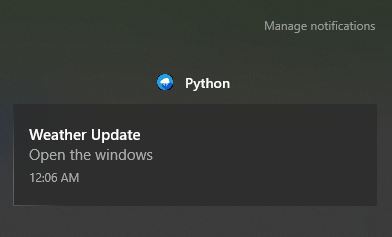

# Windows Up

Python Script for Windows 10+.

## Purpose

Sends a Windows Toast notification if weather conditions are adequate to open the physical windows of your home.

Likewise sends a notification if the weather is no longer adequate for open windows.

## Under the Hood

Pulls data from the National Weather Service forecast XML feed.

Stores and compares retrieved data via `lastdata.txt`.

Compares current temperature and dewpoint to your configured ranges.

## Recommended Usage

Pop into Windows Task Scheduler and set to run hourly. The NWS feed does not update more often than this.

Here are the Task Scheduler settings that work for me, running the script in a virtual environment:

* **Triggers**: One Time, Repeat every 1 hour for a duration of Indefinitely, Stop if it runs longer than 30 minutes, Enabled.
* **Actions**: Start a program.
   * **Program/Script**: `absolute\path\to\your\desired\pythonw.exe`
   * **Add Arguments**: `weatheralert.py`
   * **Start in**: `absolute\path\to\weatheralert\src`
